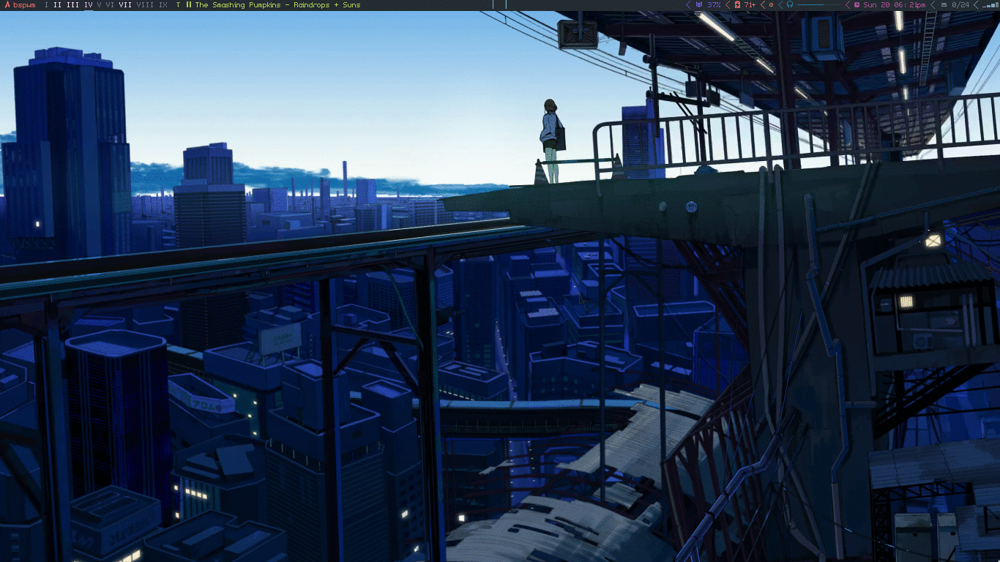
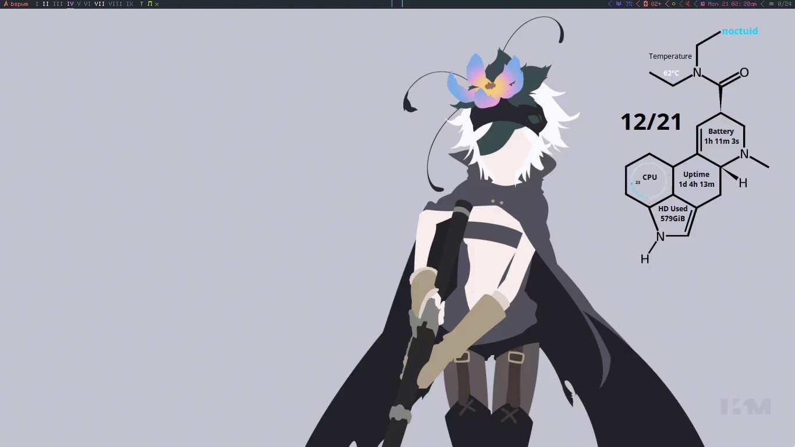
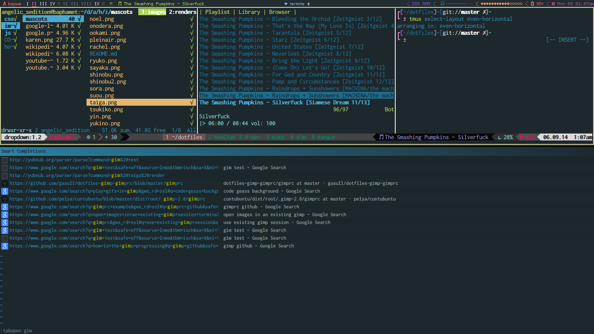
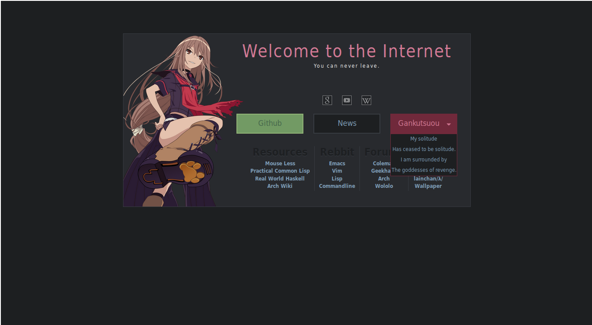
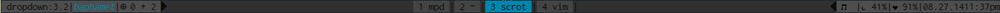
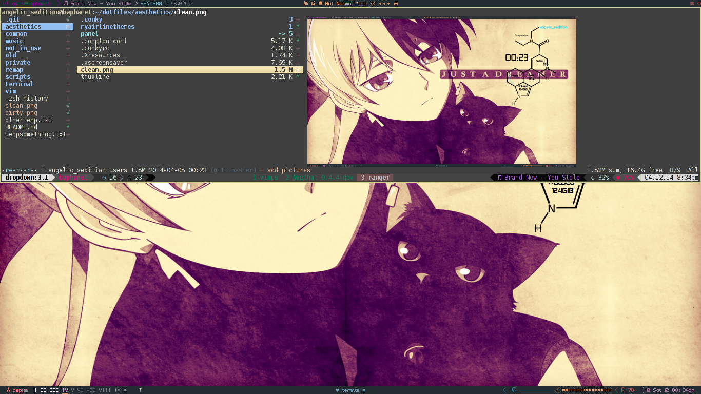

### Info
My panel is lemonbar (see [.config/bspwm/panel](./.panel_scripts/panel)). The current one is based on the default bspwm bar with some modified functions from [esn89's bar](https://github.com/esn89/dotfiles/blob/40589c82a9471dde984f52c96126db02afe8987b/bspwm/.barScripts/panel). I am using [zscroll](https://github.com/noctuid/zscroll) for scrolling. The fonts used in my panel are [uushi](https://github.com/phallus/fonts), [siji](https://github.com/gstk/siji) (for a couple icons), and IPA gothic (for Japanese characters).

The monospaced fonts that I generally use are Inconsolata (Inconsolata-g for termite and Iconsolata LGC for emacs) and Fira Mono (for vim and bemenu/dmenu).

The conky theme is [charley166's lsd theme](http://charley166.deviantart.com/art/LSD-conky-config-v2-0-392188352). I've created a black version and changed the displayed information to get rid of redundancy with my panel.

My terminal colors can be found in my [termite config](../terminal/.config/termite/config) and in my [.Xresources](../terminal/.Xresources).

See [.slimlock](./.slimlock) for my `slimlock` theme. I'm using slimlock without slim.

### Setting Wallpaper
After having tried pretty much every wallpaper setter, I've settled with using [`setroot`](https://github.com/ttzhou/setroot). It has the equivalent of feh's `--bg-fill` option (fits an image to either the height or width in order to completely cover the screen without stretching) which `xsetroot`, `hsetroot`, and `imlibsetroot` all don't have (though you could write a wrapper for imlibsetroot if you wanted to). It's also not a full image viewer.

In comparison to imlibsetroot, setroot has better multiple monitor support and a more convenient `--store` option that stores both the image location and settings used (to be restored with `--restore`). setroot allows setting different wallpaper on different monitors at the same time using `--on <number>`. This allows the use of a single command to set all wallpaper even for monitors that aren't currently plugged in. I often connect to a tv and just want the monitor to be black. Since setroot's default action without any `--on` options is to use the picture for the first (0th) monitor and set the other monitor(s) black, I just have `setroot --restore` called when adding a new monitor to achieve this.

The only thing imlibsetroot has over setroot is its specific x,y options for centering at a specific position (`-p x,y`), stretching to exact dimensions (`-s x,y`), and tiling with a specific width and height (`-t w,h`). I've never found these to be particularly useful though. setroot also has an actual manpage and some cool options such as contrast, flip, sharpen, blur, brightness, and greyscale. These options could be replicated by using imagemagick/graphicsmagick, but setroot makes it quite easy and quick to find out how altering these values will change wallpaper's look.

### Notifications
I'm using dunst for notifications. It has a nice configuration file, is scriptable, and looks good, but it has some annoying bugs and limitations (like only supporting png icons which is why I'm using a [script](../scripts/bin/dunst/prepare_image) to convert and resize icons).

### Pictures
Here I'm using [mpd-notification](https://github.com/eworm-de/mpd-notification) for song state change notifications:

[Here](./notifications.mkv) is a smaller video version of higher quality.

This gif shows panel changes and truncation from left to right. After focusing a window, the `xtitle` output is displayed in the middle. Unplugging the laptop charger changes the battery icon. Brightness level information is truncated by default and displayed for a couple of seconds after brightness changes. The volume bar is truncated when the audio is muted or at full volume. The signal strength indicator is only displayed when there is a connection.

[Here](./truncation.mkv) is a smaller video version of higher quality.

Termite and pentadactyl colours:

[My homepage](https://github.com/noctuid/homepage) (modified from [gokoururi's homepage](https://github.com/gokoururi/homepage)):

Current tmux statusline:

Older:

